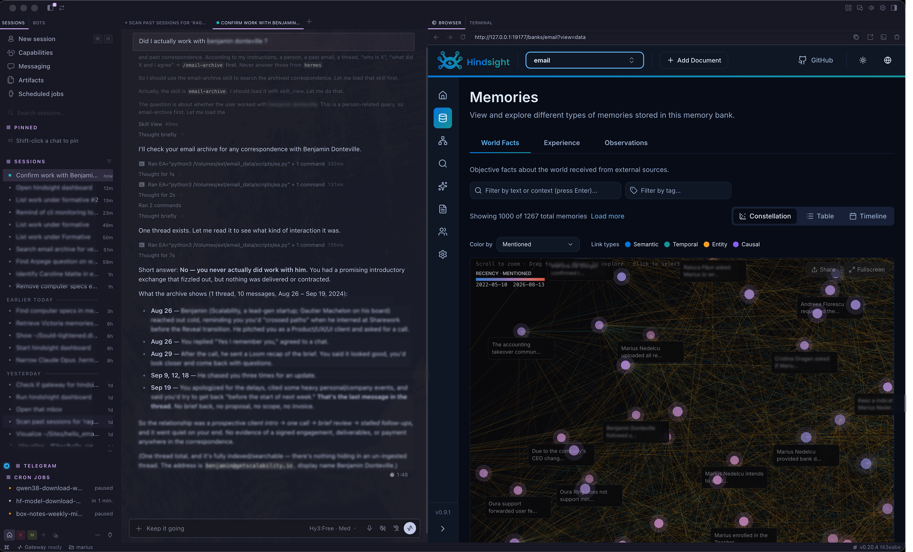
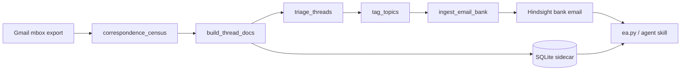

# email-to-memory

Turn a Gmail export into a **searchable memory bank** — not a pile of vectors over
newsletters and OTPs, but durable facts about people, projects, and decisions you
can actually query.

**v0** (this repo): static `.mbox` export → filter → triage → ingest into
[Hindsight](https://github.com/vectorize-io/hindsight). **v1** (planned): mail
processed as it lands in your agent — the pipeline is already upsert-safe; delivery
is the missing piece.





## Why this exists

Email archives are huge and mostly junk. Dumping everything into a memory system
pollutes recall with receipts, list mail, and verification codes. This pipeline:

1. **Filters** on headers and labels (free, auditable rules).
2. **Triages** on bodies (rules first; optional local LLM for borderline threads).
3. **Ingests whole threads** as documents so context survives extraction.
4. **Tags** with a bounded vocabulary so recall stays filterable.
5. **Reports coverage honestly** — the sidecar is complete; the bank is partial.

The agent-facing surface is one CLI (`ea.py`) and an optional Hermes skill
(`skill/email-archive/SKILL.md`).

## Installing the skill into Hermes

The skill doc and the query CLI are the only two things an agent needs at runtime.
Install both by symlinking from your clone — then `git pull` updates your agent
automatically:

```bash
mkdir -p ~/.hermes/bin/email ~/.hermes/skills/email/email-archive
ln -sf "$(pwd)/scripts/ea.py"   ~/.hermes/bin/email/ea.py
ln -sf "$(pwd)/skill/email-archive/SKILL.md" ~/.hermes/skills/email/email-archive/SKILL.md
```

Then set a concrete `EA=` path in the installed SKILL.md (replace the placeholder)
or define an alias. Restart the agent session so the skill is picked up; invoke as
`/email-archive` (hyphen — the frontmatter `name` decides, not the folder name).

## Quickstart (synthetic demo, ~2 minutes)

**Prerequisites:** Python 3.10+, a running Hindsight daemon, and a local OpenAI-compatible
LLM for triage/topics/ingest (optional for census + build only).

> **LLM gotchas:** set `llm.model` to a model your server actually serves (check
> `GET /v1/models`) — an unknown name fails with 404. Many local servers
> (llama.cpp server, oMLX, LM Studio with auth) **require an API key even on
> localhost**: export it under the env var named in `llm.api_key_env` or every LLM
> call fails with 401.

```bash
git clone https://github.com/nedzen/email-to-memory && cd email-to-memory

cp config/pipeline.example.json config/pipeline.json
# Edit owner_name, owner_emails, hindsight.api_url, llm.* as needed.

python3 tools/make_demo_mbox.py

python3 scripts/correspondence_census.py
python3 scripts/build_thread_docs.py
python3 scripts/triage_threads.py --llm          # optional LLM on borderline threads
python3 scripts/tag_topics.py                    # needs LLM
python3 scripts/ingest_email_bank.py           # needs Hindsight + LLM extraction

python3 scripts/ea.py stats
python3 scripts/ea.py who elena
python3 scripts/ea.py search "contract scope" -p elena@lighthouse.org
```

For a real Gmail Takeout: export `.mbox` + per-message metadata JSONL (see
`tools/make_demo_mbox.py` for the expected schema), point `config/pipeline.json`
at your paths, then run the same scripts.

## Key design decisions

| Decision | Why |
|---|---|
| **Document per thread** | Reply chains stay together; facts retain who said what. |
| **SQLite sidecar is complete** | Every kept thread is indexed; `in_bank` / `memory_units` track what Hindsight holds. |
| **Coverage rule** | `search` only sees threads with extracted facts. Always run `who` first and cite coverage. |
| **Bounded topic vocabulary** | 24 tags max from a fixed list — prevents tag explosion and keeps per-tag observations useful. |
| **Extraction is the expensive step** | Tags (`--retag`) and owner naming (`fix_owner_naming.py`) are PATCH repairs — no re-extraction. |
| **Upsert by `document_id`** | Re-ingesting a thread replaces it in Hindsight (`update_mode: replace`). v1-ready. |

## Measured on a real archive (anonymized aggregates)

From a production run on ~1,100 threads of personal correspondence:

| Stage | Result |
|---|---|
| After header filter + census | ~1,100 threads grouped |
| After body triage | **463 keep** / 646 drop (~42% kept) |
| LLM in triage | Needed for ~33% of threads; rules alone handled the rest |
| Fact extraction model | Smaller coder model beat larger general models on **strict JSON** output (larger models wasted tokens on preamble) |
| Owner naming | ~96% compliant from prompt; remainder fixed deterministically post-ingest |
| Ingest throughput | ~36 s/thread (local LLM, varies by hardware) |

Run your own benchmarks: `scripts/bench_extractor.py`, `scripts/eval_triage.py`.

## v0 vs v1

**v0 (shipped):** Gmail export → curated bank. Resumable multi-day ingest
(`ingest_email_bank.py --all`). Hermes skill for agent queries.

**v1 (roadmap):** Real-time processing as mail arrives in the agent. Already in place:

- `triage_msgs` revisits threads when message count grows (`--only-untriaged`).
- Re-retain same `document_id` upserts without duplicates.

Still to build:

- Ingest hook when mail lands (delivery mechanism — out of scope for this repo today).
- `raw_ref` as Message-ID lookup instead of mbox byte offsets.
- Delta mode for census (incremental sync).

## Project layout

| Path | Role |
|---|---|
| `scripts/correspondence_census.py` | Filter + thread grouping → index |
| `scripts/build_thread_docs.py` | mbox → cleaned thread text + sidecar |
| `scripts/triage_threads.py` | Body-level keep/drop |
| `scripts/tag_topics.py` | LLM topic tags from fixed vocabulary |
| `scripts/ingest_email_bank.py` | Ingest, resume, reconcile, retag, clear |
| `scripts/fix_owner_naming.py` | Post-ingest "user" → owner name repair |
| `scripts/ea.py` | Agent-facing query CLI |
| `scripts/hs.py` | Vendored Hindsight REST helper (stdlib only) |
| `skill/email-archive/SKILL.md` | Hermes agent skill |
| `docs/ARCHITECTURE.md` | Code architecture, invariants, sharp edges |
| `docs/TEST_PLAN.md` | Agent acceptance tests (P0/P1) |
| `tools/make_demo_mbox.py` | Synthetic mbox + metadata for demos |

## Contributing

Issues and PRs welcome. Keep personal data out of the repo — use `config/pipeline.json`
locally (gitignored) and the synthetic demo generator for examples. Match the existing
style: stdlib-only scripts, config-driven identity, no pip dependencies.

## Real-world use

This pipeline was built and is maintained against a production archive of
~3,300 threads / ~11,500 messages of personal correspondence (two Gmail
mailboxes, 164k messages scanned by the census stage). The design decisions,
benchmarks, and coverage semantics above come from that run — they are measured,
not aspirational.
